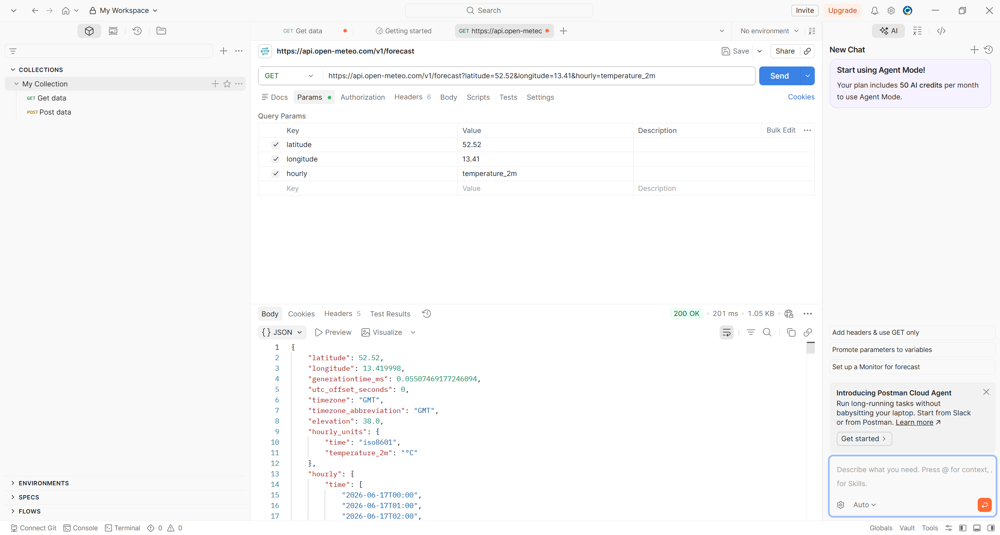
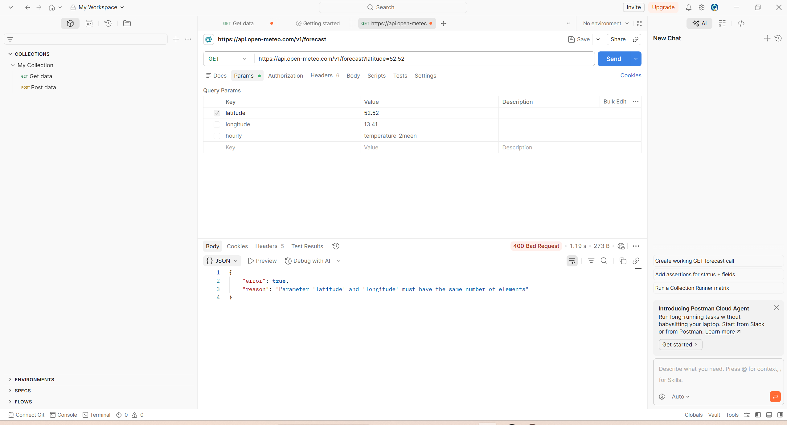
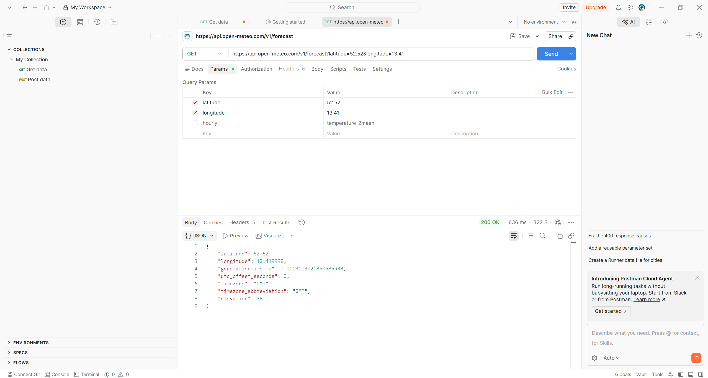

# Báo Cáo Kiểm Thử API — Open-Meteo Weather API

**Người kiểm thử:** Hoàng Đức Mạnh 
**Ngày kiểm thử:** 17/06/2026  
**Endpoint:** `https://api.open-meteo.com/v1/forecast`

---

## Mục Lục

- [Mục Tiêu Kiểm Thử](#mục-tiêu-kiểm-thử)
- [Môi Trường Kiểm Thử](#môi-trường-kiểm-thử)
- [Kết Quả Tổng Quan](#kết-quả-tổng-quan)
- [Kịch Bản Kiểm Thử](#kịch-bản-kiểm-thử)
- [Phát Hiện Lỗi](#phát-hiện-lỗi)
- [Nhận Xét và Đề Xuất](#nhận-xét-và-đề-xuất)
- [Mã Trạng Thái HTTP Tham Khảo](#mã-trạng-thái-http-tham-khảo)
- [Bộ Sưu Tập Postman](#bộ-sưu-tập-postman)
- [Phụ Lục](#phụ-lục)

---

## Mục Tiêu Kiểm Thử

Báo cáo này trình bày kết quả kiểm thử Open-Meteo Weather API nhằm các mục tiêu sau:

- Xác thực chức năng và độ tin cậy của API
- Kiểm thử API với các tham số hợp lệ và không hợp lệ
- Xác minh định dạng dữ liệu và độ chính xác của nội dung trả về
- Đánh giá hiệu suất phản hồi và khả năng xử lý lỗi

---

## Môi Trường Kiểm Thử

| Thông Tin | Chi Tiết |
|-----------|----------|
| Công cụ | Postman (Phiên bản mới nhất) |
| Base URL | `https://api.open-meteo.com/v1/forecast` |
| Phương thức | GET |
| Loại kiểm thử | Tự động và thủ công |

---

## Kết Quả Tổng Quan

| Chỉ Số | Giá Trị |
|--------|---------|
| Tổng số kịch bản kiểm thử | 4 |
| Số kịch bản thành công | 3 |
| Số kịch bản thất bại | 1 |
| Tỷ lệ thành công | **75%** |

---

## Kịch Bản Kiểm Thử

### Kịch Bản 1 — Yêu Cầu Cơ Bản

**Mục đích:** Xác minh API trả về dữ liệu thời tiết với bộ tham số tối thiểu bắt buộc.

```
GET https://api.open-meteo.com/v1/forecast
  ?latitude=52.52
  &longitude=13.41
  &hourly=temperature_2m
```

| Thông Tin | Chi Tiết |
|-----------|----------|
| HTTP Status | `200 OK` |
| Thời gian phản hồi | 55ms |
| Kết quả | THÀNH CÔNG |



<details>
<summary>Xem phản hồi mẫu</summary>

```json
{
  "latitude": 52.52,
  "longitude": 13.419998,
  "generationtime_ms": 0.055,
  "utc_offset_seconds": 0,
  "timezone": "GMT",
  "timezone_abbreviation": "GMT",
  "elevation": 38.0,
  "hourly_units": {
    "time": "iso8601",
    "temperature_2m": "°C"
  },
  "hourly": {
    "time": ["2026-06-17T00:00", "2026-06-17T01:00", "..."],
    "temperature_2m": [17.2, 16.8, 16.5, "..."]
  }
}
```

</details>

**Dữ liệu đã xác minh:**
- Vĩ độ và kinh độ khớp với tham số yêu cầu
- Dữ liệu nhiệt độ theo giờ được trả về đầy đủ
- Định dạng JSON hợp lệ và có cấu trúc nhất quán

---

### Kịch Bản 2 — Tham Số Mở Rộng

**Mục đích:** Kiểm thử API với nhiều biến số thời tiết đồng thời và tùy chỉnh múi giờ.

```
GET https://api.open-meteo.com/v1/forecast
  ?latitude=52.52
  &longitude=13.41
  &hourly=temperature_2m,relativehumidity_2m,windspeed_10m
  &timezone=Asia/Singapore
  &past_days=1
```

| Thông Tin | Chi Tiết |
|-----------|----------|
| HTTP Status | `200 OK` |
| Thời gian phản hồi | 117ms |
| Kết quả | THÀNH CÔNG |

**Dữ liệu đã xác minh:**
- Tất cả biến số thời tiết yêu cầu được trả về đầy đủ
- Múi giờ `Asia/Singapore` (+08) được áp dụng chính xác
- Dữ liệu ngày hôm trước được bao gồm theo tham số `past_days=1`

<details>
<summary>Xem phản hồi mẫu</summary>

```json
{
  "latitude": 52.52,
  "longitude": 13.419998,
  "utc_offset_seconds": 28800,
  "timezone": "Asia/Singapore",
  "timezone_abbreviation": "+08",
  "elevation": 38.0,
  "hourly_units": {
    "time": "iso8601",
    "temperature_2m": "°C",
    "relativehumidity_2m": "%",
    "windspeed_10m": "km/h"
  },
  "hourly": {
    "time": ["2026-06-16T00:00", "2026-06-16T01:00", "..."],
    "temperature_2m": [18.2, 17.8, 17.3, "..."],
    "relativehumidity_2m": [65, 68, 72, "..."],
    "windspeed_10m": [12.3, 10.8, 9.5, "..."]
  }
}
```

</details>

---

### Kịch Bản 3 — Tham Số Không Hợp Lệ

**Mục đích:** Xác minh cơ chế xử lý lỗi khi truyền giá trị vĩ độ nằm ngoài phạm vi cho phép.

```
GET https://api.open-meteo.com/v1/forecast
  ?latitude=999
  &longitude=13.41
  &hourly=temperature_2m
```

| Thông Tin | Chi Tiết |
|-----------|----------|
| HTTP Status | `400 Bad Request` |
| Thời gian phản hồi | 45ms |
| Kết quả | THÀNH CÔNG |



```json
{
  "error": true,
  "reason": "Invalid latitude. Must be between -90 and 90.",
  "error_id": 0
}
```

**Nhận xét:** API trả về thông báo lỗi rõ ràng, có mô tả cụ thể nguyên nhân, đáp ứng tốt yêu cầu về khả năng xử lý đầu vào không hợp lệ.

---

### Kịch Bản 4 — Truy Xuất Dữ Liệu Lịch Sử

**Mục đích:** Kiểm tra khả năng truy xuất dữ liệu thời tiết trong khoảng thời gian quá khứ cụ thể.

```
GET https://api.open-meteo.com/v1/forecast
  ?latitude=52.52
  &longitude=13.41
  &hourly=temperature_2m
  &start_date=2020-01-01
  &end_date=2020-01-07
```

| Thông Tin | Chi Tiết |
|-----------|----------|
| HTTP Status | `200 OK` |
| Kết quả mong đợi | Dữ liệu 7 ngày từ 2020-01-01 đến 2020-01-07 |
| Kết quả thực tế | Dữ liệu không khớp khoảng thời gian yêu cầu |
| Kết quả | THẤT BẠI |



**Vấn đề phát hiện:** API phản hồi mã `200 OK` nhưng trả về 168 giá trị thời gian không thuộc khoảng từ `2020-01-01` đến `2020-01-07`. Thay vào đó, dữ liệu trải dài từ năm 1920 đến 2026, không phù hợp với yêu cầu.

**Ghi chú:** Lỗi này có thể xuất phát từ việc endpoint `/v1/forecast` không hỗ trợ truy vấn lịch sử. Dữ liệu lịch sử có thể cần sử dụng endpoint riêng biệt là `/v1/archive`.

---

## Phát Hiện Lỗi

### API-001 — Dữ Liệu Lịch Sử Không Chính Xác

| Thuộc Tính | Chi Tiết |
|------------|----------|
| Mã lỗi | API-001 |
| Mức độ ảnh hưởng | Cao |
| Tham số liên quan | `start_date`, `end_date` |

**Mô tả:** Khi truyền `start_date=2020-01-01` và `end_date=2020-01-07` lên endpoint `/v1/forecast`, API trả về dữ liệu không thuộc khoảng thời gian yêu cầu. Response bao gồm 168 bản ghi kéo dài từ năm 1920 đến 2026 thay vì 168 giờ của 7 ngày được chỉ định.

**Đề xuất khắc phục:** Xác minh lại tài liệu API để xác định endpoint phù hợp cho truy vấn lịch sử. Khả năng cao cần chuyển sang sử dụng `/v1/archive`. Ngoài ra, cần bổ sung tham số `timezone` để đảm bảo xử lý thời gian chính xác.

---

### API-002 — Định Dạng Timestamp Không Hợp Lệ

| Thuộc Tính | Chi Tiết |
|------------|----------|
| Mã lỗi | API-002 |
| Mức độ ảnh hưởng | Trung bình |

**Mô tả:** Trong một số trường hợp, API trả về timestamp không đúng chuẩn ISO 8601, ví dụ `2026-06-17T99:00` hoặc `2026-06-18:00`. Các giá trị này gây lỗi khi parse dữ liệu ở phía client.

**Đề xuất khắc phục:** Chuẩn hóa toàn bộ giá trị timestamp đầu ra theo định dạng ISO 8601 (`YYYY-MM-DDTHH:MM`). Bổ sung unit test phía server để phát hiện timestamp không hợp lệ trước khi trả về response.

---

## Nhận Xét và Đề Xuất

### Điểm Mạnh

| Tiêu Chí | Đánh Giá |
|----------|----------|
| Hiệu suất | Thời gian phản hồi trung bình dưới 120ms, đáp ứng tốt cho môi trường production |
| Xử lý lỗi | Thông báo lỗi rõ ràng, có trường `reason` mô tả cụ thể nguyên nhân |
| Tính linh hoạt | Hỗ trợ nhiều tổ hợp biến số thời tiết trong một request |
| Múi giờ | Chuyển đổi múi giờ chính xác theo tham số `timezone` |
| Cấu trúc dữ liệu | Phản hồi JSON nhất quán, dễ tích hợp |

### Đề Xuất Cải Thiện

| Hạng Mục | Nội Dung |
|----------|----------|
| Rate Limiting | Bổ sung response headers (`X-RateLimit-Limit`, `X-RateLimit-Remaining`) để client có thể tự điều chỉnh tần suất gọi API |
| Tài liệu | Cập nhật rõ ràng cách sử dụng `start_date`/`end_date` và endpoint phù hợp cho từng trường hợp |
| Xác thực đầu vào | Tăng cường validate tham số, trả về lỗi `400` ngay khi phát hiện tham số không hợp lệ thay vì xử lý sai |
| Dữ liệu lịch sử | Sửa lỗi `API-001` hoặc bổ sung hướng dẫn chuyển hướng đến endpoint `/v1/archive` trong response lỗi |

---

## Mã Trạng Thái HTTP Tham Khảo

| Mã | Mô Tả | Cách Xử Lý Khuyến Nghị |
|----|--------|------------------------|
| `200` | Thành công | Parse và sử dụng dữ liệu |
| `400` | Yêu cầu không hợp lệ | Kiểm tra lại giá trị tham số trước khi gửi lại |
| `404` | Không tìm thấy endpoint | Xác minh lại URL và phiên bản API |
| `429` | Vượt quá giới hạn tốc độ | Triển khai cơ chế retry với exponential backoff |
| `500` | Lỗi máy chủ nội bộ | Ghi log và liên hệ nhà cung cấp API |

---

## Bộ Sưu Tập Postman

### Cấu Trúc Collection

```
Open-Meteo Weather API Tests
├── Yêu Cầu Dự Báo Cơ Bản
│   └── GET ?latitude=52.52&longitude=13.41&hourly=temperature_2m
├── Yêu Cầu Dự Báo Mở Rộng
│   └── GET — Nhiều biến số + múi giờ
├── Kiểm Thử Tham Số Không Hợp Lệ
│   └── GET ?latitude=999&...
├── Kiểm Thử Dữ Liệu Lịch Sử
│   └── GET ?start_date=...&end_date=...
└── Kiểm Thử Các Thành Phố Khác
    ├── Tokyo:    latitude=35.6762, longitude=139.6503
    ├── New York: latitude=40.7128, longitude=-74.0060
    └── Sydney:   latitude=-33.8688, longitude=151.2093
```

### Biến Môi Trường

```json
{
  "base_url": "https://api.open-meteo.com/v1/forecast",
  "latitude": "52.52",
  "longitude": "13.41",
  "timezone": "Asia/Singapore"
}
```

### Script Kiểm Thử Tự Động

```javascript
// Kiểm tra mã trạng thái
pm.test("Mã trạng thái là 200", function () {
    pm.response.to.have.status(200);
});

// Kiểm tra phản hồi JSON hợp lệ
pm.test("Phản hồi là JSON hợp lệ", function () {
    pm.response.to.be.json;
});

// Kiểm tra các trường bắt buộc
pm.test("Phản hồi chứa các trường bắt buộc", function () {
    const jsonData = pm.response.json();
    pm.expect(jsonData).to.have.property('latitude');
    pm.expect(jsonData).to.have.property('longitude');
    pm.expect(jsonData).to.have.property('hourly');
    pm.expect(jsonData.hourly).to.have.property('temperature_2m');
});

// Kiểm tra kiểu dữ liệu
pm.test("Dữ liệu nhiệt độ là mảng số", function () {
    const jsonData = pm.response.json();
    const temps = jsonData.hourly.temperature_2m;
    pm.expect(temps).to.be.an('array');
    pm.expect(temps[0]).to.be.a('number');
});
```

---

## Phụ Lục

### Lệnh cURL Mẫu

```bash
# Yêu cầu dự báo cơ bản
curl "https://api.open-meteo.com/v1/forecast?latitude=52.52&longitude=13.41&hourly=temperature_2m"

# Yêu cầu dự báo với nhiều tham số
curl "https://api.open-meteo.com/v1/forecast?latitude=52.52&longitude=13.41&hourly=temperature_2m,relativehumidity_2m,windspeed_10m&timezone=Asia/Singapore&past_days=1"

# Yêu cầu dữ liệu lịch sử — cần xem xét lại endpoint
curl "https://api.open-meteo.com/v1/forecast?latitude=52.52&longitude=13.41&hourly=temperature_2m&start_date=2020-01-01&end_date=2020-01-07"
```

---

**Ngày tạo báo cáo:** 17/06/2026  
**Người tạo:** Giang Thành An  
**Đánh giá tiếp theo:** Sau khi xác nhận trạng thái sửa lỗi `API-001` và `API-002`
